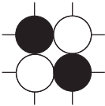

# Crossway

Crossway is a game played with a Go set designed by Mark Steere in 2007.

The goal of the game is to create a continous route of same color stones between two parallel sides of the board. 
Respectively connecting the left side to the right one for the white player and the up to the bottom for the black player.
Each stone in the sequence must be connected to neighboring stones in the sequence via horizontal, vertical, or diagonal adjacencies. 

Players take turns adding their stones to the board, one stone per turn. 
A player must never complete the formation shown in Figure or a 90 degree rotation of this formation. 

White has the option of switching colors with Black, and claiming Black’s first move as his own.

Original rules can be found [at the author website](https://boardgamegeek.com/boardgame/30517/crossway).

### Installation

Requires: Gradle, JVM v.11.0

Clone the repository with 

`git clone https://github.com/Militeee/crossway2`

`cd/crossway2`

`./gradlew build`

Run with 

`cd /build/classes/java/main`

`java dssc.crossway.Main`
